# UH-01: Dashboard User Management Refactor & Architecture

## Overview
This document details the refactoring, modularization, and styling migration of the CallBook Users Dashboard. The original prototype was provided as a monolithic component in [example.tsx](file:///workspaces/cc_frontend_v2_next/src/app/dashboard/example.tsx) with inline CSS styles. 

The entire interface has been migrated to **Tailwind CSS (v4)** without any visual discrepancies, adhering strictly to **SOLID** design principles and clean architecture. Every component has been placed in an organized directory structure to ensure high scalability, testability, and legibility.

---

## Visual Architecture Representation

### Component Hierarchy & Data Flow

```mermaid
graph TD
    subgraph Routing ["Next.js App Router (src/app/dashboard)"]
        DashboardLayout["DashboardLayout (layout.tsx)"]
        DashboardPage["DashboardPage (page.tsx)"]
        UsersPage["UsersPage (users/page.tsx)"]
        ExamplePage["UsersPage (example.tsx)"]
    end

    subgraph Shell ["Dashboard Shell Components (src/components/dashboard)"]
        SidebarComp["Sidebar (sidebar/Sidebar.tsx)"]
        HeaderComp["Header (header/Header.tsx)"]
    end

    subgraph SidebarSub ["Sidebar Subcomponents"]
        SidebarLogo["SidebarLogo.tsx"]
        SidebarNav["SidebarNav.tsx"]
        SidebarNavItem["SidebarNavItem.tsx"]
        SidebarQueue["SidebarQueueHealth.tsx"]
    end

    subgraph HeaderSub ["Header Subcomponents"]
        HeaderSearch["HeaderSearch.tsx"]
        HeaderNotif["HeaderNotifications.tsx"]
        HeaderProfile["HeaderUserProfile.tsx"]
    end

    subgraph UsersDomain ["Users Feature Domain (src/components/dashboard/users)"]
        UsersView["UsersView.tsx (Orchestrator)"]
        PageHeader["PageHeader.tsx"]
        StatsGrid["StatsGrid.tsx"]
        StatsCard["StatsCard.tsx"]
        RoleFilterTabs["RoleFilterTabs.tsx"]
        UsersTable["UsersTable.tsx"]
        UsersTableRow["UsersTableRow.tsx"]
    end

    subgraph Common ["Reusable / Atomic Components (src/components/common)"]
        RoleBadge["RoleBadge.tsx"]
        StatusBadge["StatusBadge.tsx"]
        UserAvatar["UserAvatar.tsx"]
        Icons["Icons.tsx"]
    end

    subgraph StateLogic ["State & Business Logic (src/hooks)"]
        useUsersFilter["useUsersFilter.ts"]
    end

    subgraph DataContracts ["Data & Types (src/data & src/types)"]
        UsersData["users.data.ts"]
        NavData["navigation.data.ts"]
        UserTypes["user.types.ts"]
        NavTypes["navigation.types.ts"]
        StatsTypes["stats.types.ts"]
    end

    DashboardLayout --> SidebarComp
    DashboardLayout --> HeaderComp
    DashboardLayout --> DashboardPage
    DashboardLayout --> UsersPage

    DashboardPage --> UsersView
    UsersPage --> UsersView
    ExamplePage --> SidebarComp
    ExamplePage --> HeaderComp
    ExamplePage --> UsersView

    SidebarComp --> SidebarLogo
    SidebarComp --> SidebarNav
    SidebarComp --> SidebarQueue
    SidebarNav --> SidebarNavItem

    HeaderComp --> HeaderSearch
    HeaderComp --> HeaderNotif
    HeaderComp --> HeaderProfile
    HeaderProfile --> UserAvatar

    UsersView --> useUsersFilter
    UsersView --> PageHeader
    UsersView --> StatsGrid
    UsersView --> RoleFilterTabs
    UsersView --> UsersTable

    StatsGrid --> StatsCard
    UsersTable --> UsersTableRow
    UsersTableRow --> UserAvatar
    UsersTableRow --> RoleBadge
    UsersTableRow --> StatusBadge

    useUsersFilter --> UsersData
    useUsersFilter --> UserTypes
    useUsersFilter --> StatsTypes

    SidebarNav --> NavData
    SidebarNav --> NavTypes
```



---

## SOLID Principles Implementation

### 1. Single Responsibility Principle (SRP)
Each module, interface, and component is dedicated to a single concern:
- **[user.types.ts](file:///workspaces/cc_frontend_v2_next/src/types/user.types.ts)**: Declares data types (`Role`, `Status`, `User`, `RoleFilter`).
- **[navigation.types.ts](file:///workspaces/cc_frontend_v2_next/src/types/navigation.types.ts)**: Declares navigation and SLA widget types.
- **[stats.types.ts](file:///workspaces/cc_frontend_v2_next/src/types/stats.types.ts)**: Declares statistic metrics and role filter tab models.
- **[users.data.ts](file:///workspaces/cc_frontend_v2_next/src/data/users.data.ts)**: Provides static datasets and pure helper calculations (`getInitials`, `countByRole`).
- **[useUsersFilter.ts](file:///workspaces/cc_frontend_v2_next/src/hooks/useUsersFilter.ts)**: Encapsulates state management for active role filtering, live search queries, and dynamic stats calculation.
- **[RoleBadge.tsx](file:///workspaces/cc_frontend_v2_next/src/components/common/RoleBadge.tsx)**: Responsible solely for role pill presentation.
- **[StatusBadge.tsx](file:///workspaces/cc_frontend_v2_next/src/components/common/StatusBadge.tsx)**: Responsible solely for status dot and status label display.
- **[UserAvatar.tsx](file:///workspaces/cc_frontend_v2_next/src/components/common/UserAvatar.tsx)**: Responsible solely for initials circle rendering.

### 2. Open / Closed Principle (OCP)
Components are open for extension without modifying their core logic:
- **[`RoleBadge`](file:///workspaces/cc_frontend_v2_next/src/components/common/RoleBadge.tsx#L15)** uses a lookup map for styles and accepts additional `className` overrides.
- **[`StatusBadge`](file:///workspaces/cc_frontend_v2_next/src/components/common/StatusBadge.tsx#L15)** dynamically resolves status color values and allows style extension.
- **[`SidebarNav`](file:///workspaces/cc_frontend_v2_next/src/components/dashboard/sidebar/SidebarNav.tsx#L34)** renders items dynamically via configuration arrays (`NavItem[]`), allowing new dashboard sections to be added without touching the navigation component JSX.
- **[`StatsGrid`](file:///workspaces/cc_frontend_v2_next/src/components/dashboard/users/StatsGrid.tsx#L9)** renders arbitrary metric cards based on passed `StatItem[]` props.

### 3. Liskov Substitution Principle (LSP)
- Subtypes and replacement wrappers conform to the contracts expected by consumers:
  - [sideBar.component.tsx](file:///workspaces/cc_frontend_v2_next/src/components/sideBar.component.tsx) and [header.component.tsx](file:///workspaces/cc_frontend_v2_next/src/components/header.component.tsx) seamlessly wrap the new modular implementations, ensuring full backward compatibility with existing imports.
  - Interactive elements ([`SidebarNavItem`](file:///workspaces/cc_frontend_v2_next/src/components/dashboard/sidebar/SidebarNavItem.tsx#L10), [`HeaderNotifications`](file:///workspaces/cc_frontend_v2_next/src/components/dashboard/header/HeaderNotifications.tsx#L10), [`RoleFilterTabs`](file:///workspaces/cc_frontend_v2_next/src/components/dashboard/users/RoleFilterTabs.tsx#L12)) implement accessible semantics (`aria-current`, `aria-pressed`, `role="group"`) and standard HTML attributes.

### 4. Interface Segregation Principle (ISP)
Interfaces are fine-grained so components do not depend on methods or fields they do not use:
- [`RoleBadgeProps`](file:///workspaces/cc_frontend_v2_next/src/components/common/RoleBadge.tsx#L4) requires only `{ role: Role; className?: string }`.
- [`StatusBadgeProps`](file:///workspaces/cc_frontend_v2_next/src/components/common/StatusBadge.tsx#L4) requires only `{ status: Status; className?: string }`.
- [`UserAvatarProps`](file:///workspaces/cc_frontend_v2_next/src/components/common/UserAvatar.tsx#L4) accepts `{ name?: string; initials?: string; variant?: 'table' | 'header' }`.
- [`StatsCardProps`](file:///workspaces/cc_frontend_v2_next/src/components/dashboard/users/StatsCard.tsx#L4) depends solely on `{ label: string; value: string }`.

### 5. Dependency Inversion Principle (DIP)
- Presentational components like [`UsersTable`](file:///workspaces/cc_frontend_v2_next/src/components/dashboard/users/UsersTable.tsx#L11) and [`StatsGrid`](file:///workspaces/cc_frontend_v2_next/src/components/dashboard/users/StatsGrid.tsx#L9) depend on abstract data arrays passed via props rather than direct hardcoded imports.
- View components ([`UsersView`](file:///workspaces/cc_frontend_v2_next/src/components/dashboard/users/UsersView.tsx#L18)) delegate data querying and filtering to the [`useUsersFilter`](file:///workspaces/cc_frontend_v2_next/src/hooks/useUsersFilter.ts#L11) hook abstraction, separating UI orchestration from data transformation.

---

## File Structure Created & Updated

```
src/
├── types/
│   ├── user.types.ts                 # Role, Status, User, RoleFilter
│   ├── navigation.types.ts           # NavItem, QueueHealth
│   └── stats.types.ts                # StatItem, RoleTab
├── data/
│   ├── users.data.ts                 # Initial dataset and calculation helpers
│   └── navigation.data.ts            # Sidebar navigation config and SLA defaults
├── hooks/
│   └── useUsersFilter.ts             # Role filtering and search hook
├── components/
│   ├── common/
│   │   ├── Icons.tsx                 # SVG Icons (Phone, Home, Users, Settings, Search, Bell, Plus, MoreDots)
│   │   ├── RoleBadge.tsx             # Role pill with Tailwind color mapping
│   │   ├── StatusBadge.tsx           # Status indicator dot and label
│   │   └── UserAvatar.tsx            # Initials avatar (table & header variants)
│   ├── dashboard/
│   │   ├── sidebar/
│   │   │   ├── SidebarLogo.tsx       # Brand logo with accent color
│   │   │   ├── SidebarNavItem.tsx    # Single nav item with active inset shadow
│   │   │   ├── SidebarNav.tsx        # Navigation list with route detection
│   │   │   ├── SidebarQueueHealth.tsx # SLA queue health widget
│   │   │   └── Sidebar.tsx           # Sidebar container
│   │   ├── header/
│   │   │   ├── HeaderSearch.tsx      # Search input with icon
│   │   │   ├── HeaderNotifications.tsx # Bell icon button
│   │   │   ├── HeaderUserProfile.tsx # User profile badge (Luis Reyes / Admin)
│   │   │   └── Header.tsx            # Header container
│   │   └── users/
│   │       ├── PageHeader.tsx        # Title, subtitle, "Create user" button
│   │       ├── StatsCard.tsx         # Single stat card with mono metric
│   │       ├── StatsGrid.tsx         # Responsive stats grid
│   │       ├── RoleFilterTabs.tsx    # Accessible role tab buttons with counters
│   │       ├── UsersTableRow.tsx     # Single table row
│   │       ├── UsersTable.tsx        # Table container with accessibility tags
│   │       └── UsersView.tsx         # Composed Users page view
│   ├── sideBar.component.tsx         # Legacy/root sidebar export
│   └── header.component.tsx          # Legacy/root header export
└── app/
    ├── globals.css                   # IBM Plex fonts and Tailwind configuration
    └── dashboard/
        ├── layout.tsx                # Dashboard shell layout (Sidebar + Header + children)
        ├── page.tsx                  # Main dashboard entrypoint (/dashboard)
        ├── users/page.tsx            # Users route (/dashboard/users)
        ├── home/page.tsx             # Home route (/dashboard/home)
        ├── settings/page.tsx         # Settings route (/dashboard/settings)
        └── example.tsx               # Refactored example component
```

---

## Visual Styling Migration (CSS to Tailwind)

All inline CSS styles and Google Font definitions were mapped to exact Tailwind CSS classes:

| Visual Element | Original CSS Rule | Tailwind CSS Class / Utility |
| :--- | :--- | :--- |
| **Typography (Body)** | `'IBM Plex Sans', system-ui, sans-serif` | `font-sans` configured in `@theme` in `globals.css` |
| **Typography (Mono)** | `'IBM Plex Mono', ui-monospace, monospace` | `font-mono` configured in `@theme` in `globals.css` |
| **Page Background** | `background: #F4F2EF` | `bg-[#F4F2EF]` |
| **Text Primary** | `color: #1F1C1E` | `text-[#1F1C1E]` |
| **Text Muted** | `color: #6B6560` | `text-[#6B6560]` |
| **Accent Color** | `#6E4F68` | Configurable prop or `bg-[#6E4F68]` |
| **Sidebar BG** | `background: #262325` | `bg-[#262325]` |
| **Active Nav Item** | `bg: #3A3538`, `boxShadow: inset 3px 0 0 #6E4F68` | `bg-[#3A3538] text-white shadow-[inset_3px_0_0_#6E4F68]` |
| **Queue Health Card** | `background: #332F32`, `borderRadius: 10px` | `bg-[#332F32] rounded-[10px] p-[14px_12px]` |
| **Search Input** | `height: 40px`, `border: 1px solid #DDD7D1`, `borderRadius: 8px` | `h-10 border border-[#DDD7D1] rounded-lg bg-white` |
| **Header Avatar** | `34x34`, `bg: #D9CFD6`, `color: #3F2D3C` | `w-[34px] h-[34px] rounded-full bg-[#D9CFD6] text-[#3F2D3C]` |
| **Table Avatar** | `34x34`, `bg: #EEE9ED`, `color: #4F3A4B` | `w-[34px] h-[34px] rounded-full bg-[#EEE9ED] text-[#4F3A4B]` |
| **Stats Card** | `bg: #F7F5F3`, `borderRadius: 10px`, `26px mono` | `bg-[#F7F5F3] rounded-[10px] p-[14px_16px] font-mono text-[26px]` |
| **Filter Container** | `background: #EAE6E2`, `borderRadius: 8px`, `padding: 3px` | `bg-[#EAE6E2] rounded-lg p-[3px] flex flex-wrap gap-1` |
| **Admin Pill** | `background: #EEE5EC`, `color: #5E3A57` | `bg-[#EEE5EC] text-[#5E3A57] h-[26px] px-[10px] rounded-full` |
| **Supervisor Pill** | `background: #E3EEF8`, `color: #1F4E79` | `bg-[#E3EEF8] text-[#1F4E79] h-[26px] px-[10px] rounded-full` |
| **Agent Pill** | `background: #E6F1E9`, `color: #25553A` | `bg-[#E6F1E9] text-[#25553A] h-[26px] px-[10px] rounded-full` |
| **Status Dots** | `Active: #2E8B57`, `On break: #C7781F`, `Inactive: #9A9397` | `w-2 h-2 rounded-full` with respective background classes |

---

## Verification

The refactored code has passed all checks:

1. **Linting**:
   ```bash
   npm run lint
   ```
   *Result*: **0 errors, 0 warnings**.

2. **Type Checking & Production Build**:
   ```bash
   npm run build
   ```
   *Result*: Successfully compiled via Next.js 16 (Turbopack). All pages statically generated:
   - `○ /`
   - `○ /_not-found`
   - `○ /dashboard`
   - `○ /dashboard/home`
   - `○ /dashboard/settings`
   - `○ /dashboard/users`
   - `○ /login`

3. **Visual Regression**:
   - Zero visual drift from [example.tsx](file:///workspaces/cc_frontend_v2_next/src/app/dashboard/example.tsx).
   - Responsive flex and grid layouts match the source dimensions.
